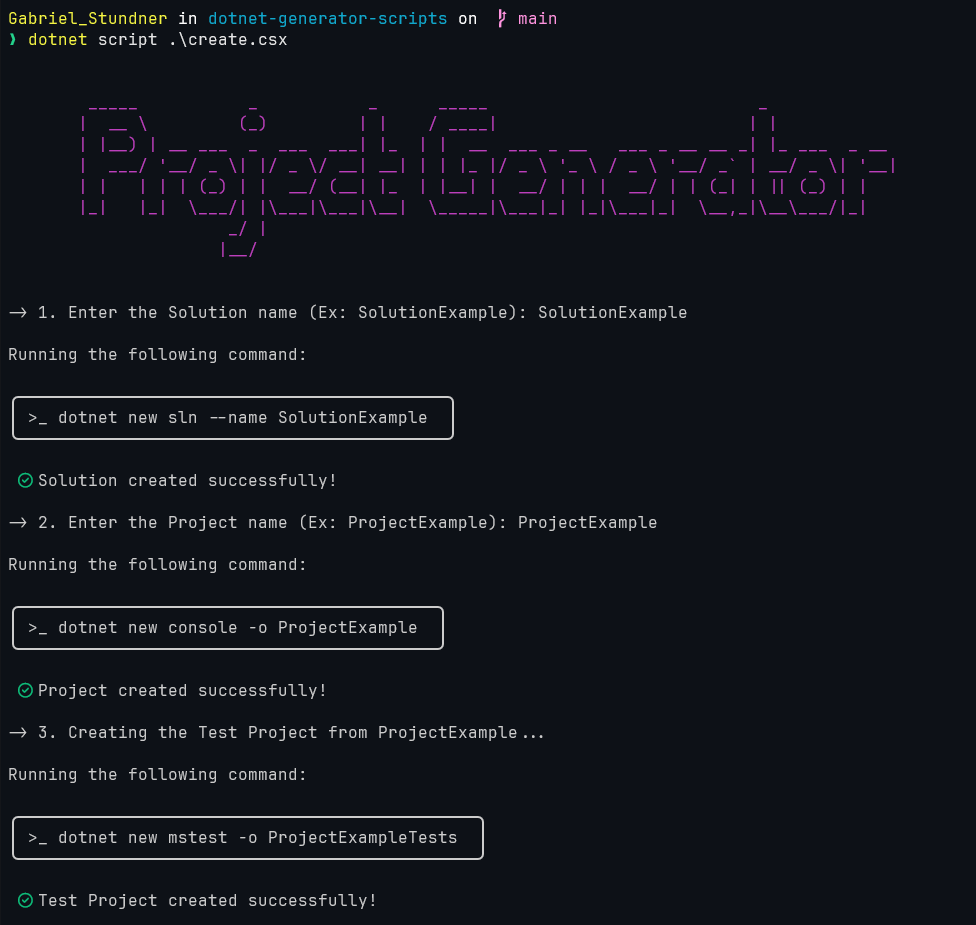
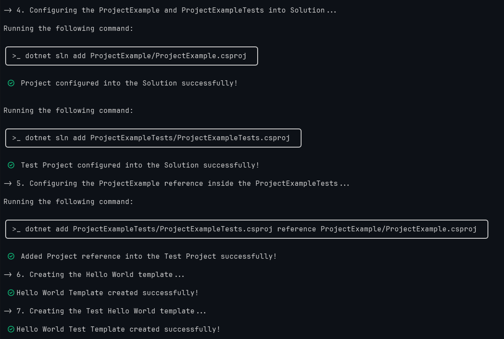
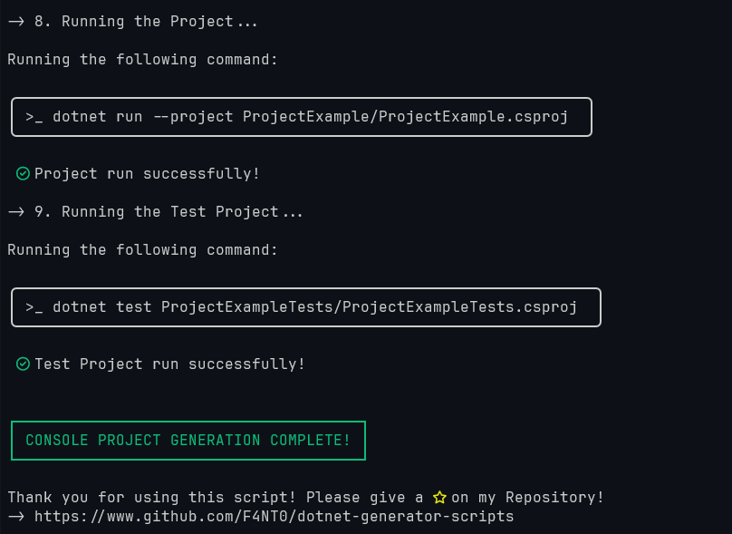

<table align="center"><tr><td align="center" width="9999">
    <h1>.NET Generator Scripts</h1>
</td></tr></table>

---

## First Configurations

### Windows

- Install Windows Terminal
- Install Jetbrains Nerd Font Mono in a Thin Mode
- Configure Windows Terminal to use the Jetbrains Font
- Configurations of the terminal:
    - Appearance > Color Scheme Dark+
    - Appearance > JetBrainsMono Nerd Font
    - Appearance > Font Size 12
    - Appearance > Font Weight Thin
- Install .NET project into windows terminal.
- Install .NET dependency called __dotnet-script__.

```shell

dotnet tool install -g dotnet-script

```

<table align="center"><tr><td align="center" width="9999">
    <h2>Generate Console Projects</h2>
</td></tr></table>

- Run the `create.csx` file to generate locally the Solution,Project and Test Project.
- This is going to create the Console Project with an Hello World Example.

```csharp

dotnet script create.csx

```

<table align="center"><tr><td align="center" width="9999">
    
</td></tr></table>

<table align="center"><tr><td align="center" width="9999">
    
</td></tr></table>

<table align="center"><tr><td align="center" width="9999">
    
</td></tr></table>


## ASP.NET Core Projects

- TBD

## Minimal API Projects

- TBD

## AI centered Projects

- TBD
